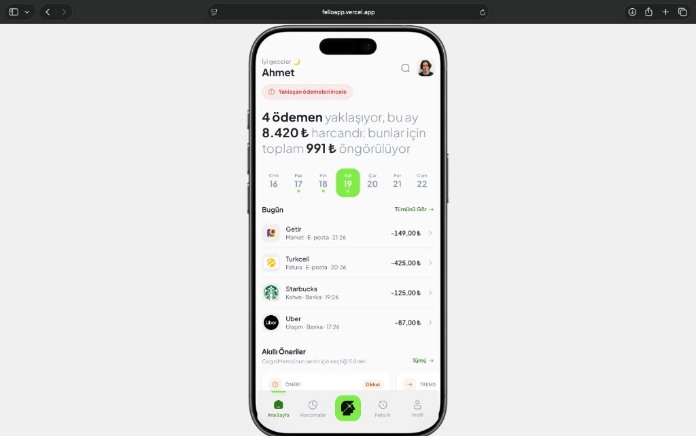

# Fello — Abonelik ve Harcama Asistanı

Mobil odaklı bir finans asistanı: harcamalarını takip et, yaklaşan ödemeleri gör, abonelik ve fatura uyarılarını yönet. **Fello AI** ile Türkçe sohbet ederek tasarruf önerileri al.

**[Canlı demo → felloapp.vercel.app](https://felloapp.vercel.app)**

<p align="center">
  <a href="https://felloapp.vercel.app">
    
  </a>
</p>

---

## Özellikler

- **Ana sayfa** — Günlük harcamalar, aylık özet ve yaklaşan ödemeler
- **Harcamalar** — İşlem listesi, fiş detayı, yeni harcama ekleme
- **Akıllı öneriler** — Abonelik, fatura artışı (bill creep), kullanılmayan servisler ve trend uyarıları
- **Fello AI** — OpenAI tabanlı sohbet asistanı; harcama özeti, hafıza araması ve pazar karşılaştırma araçları
- **CogniMemo** — Kullanıcı hafızasına ingest / search (API anahtarı ile)
- **Abonelik pazarı** — Operatör tarifeleri (scraping veya fallback katalog)
- **Profil** — Banka, bildirim ve gizlilik ayarları (demo UI)

## Teknoloji

| Katman | Stack |
|--------|--------|
| Framework | [Next.js 16](https://nextjs.org) (App Router) |
| UI | React 19, Tailwind CSS 4, [Wise Neptune](https://github.com/transferwise/neptune-css) |
| Veri | Prisma + SQLite (yerel), Vercel’de in-memory demo |
| AI | [Vercel AI SDK](https://sdk.vercel.ai), OpenAI |
| Hafıza | CogniMemo HTTP API |

## Hızlı başlangıç

```bash
git clone https://github.com/Vlknctn/felloapp.git
cd felloapp
npm install
cp .env.example .env
npm run dev
```

Tarayıcıda [http://localhost:3000](http://localhost:3000) adresini aç.

### Ortam değişkenleri

`.env.example` dosyasını kopyalayıp doldur:

| Değişken | Açıklama |
|----------|----------|
| `OPENAI_API_KEY` | Fello AI sohbeti (yoksa `AGENT_FALLBACK=true` ile kural tabanlı yanıt) |
| `COGNIMEMO_API_URL` / `COGNIMEMO_API_KEY` | Hafıza ingest & search |
| `DATABASE_URL` | SQLite yolu (`file:./dev.db`) |
| `DEMO_MODE` | Demo kullanıcı ve mock veri (`true` önerilir) |
| `FELLO_USER_ID` | Tek kullanıcı demo kimliği |
| `MARKET_SCRAPE_ENABLED` | Canlı tarife scraping (`false` = fallback katalog) |

Vercel dağıtımında SQLite çalışmaz; `DEMO_MODE=true` ile uygulama in-memory mock veri kullanır (bkz. `vercel.json`).

## Komutlar

```bash
npm run dev          # Geliştirme sunucusu (port 3000)
npm run build        # Prisma generate, db push, seed, production build
npm run db:push      # Şemayı veritabanına uygula
npm run db:seed      # Demo verisini yükle
npm run lint         # ESLint
```

## Proje yapısı

```
src/
├── app/              # Sayfalar ve API route'ları
├── components/       # UI, view'lar, paylaşılan bileşenler
├── server/           # Agent, CogniMemo, pazar scraping, Prisma
├── lib/              # Tipler, mock veri, yardımcılar
└── contexts/         # Uygulama state
prisma/               # SQLite şeması
scripts/              # Seed script
```

## API özeti

| Endpoint | Açıklama |
|----------|----------|
| `POST /api/agent/chat` | Fello AI sohbet |
| `GET /api/transactions` | İşlem listesi |
| `GET /api/insights` | Akıllı öneriler |
| `POST /api/memory/ingest` | CogniMemo’ya hafıza yaz |
| `POST /api/memory/search` | CogniMemo’da ara |
| `GET /api/market/catalog` | Abonelik / tarife kataloğu |

## Lisans

Bu proje hackathon / demo amaçlıdır. Ticari kullanım için lisans netleştirilmelidir.
